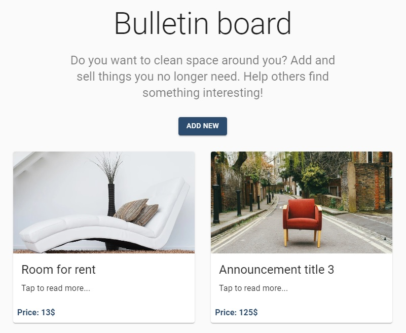

<p align="center">
<a href="https://bulletin-board-web.herokuapp.com/"></a>
</p>


# <p align="center">📝 Bulletin board app</p>
<p align="center">Project for mastering React, Express and MongoDB</p>

</br>

## Table of Contents

- [What's this project about?](#ab)
- [Technologies used](#tech)
- [What I learned?](#what)
- [Interesting code snippet](#inter)
- [Installation and quick start](#install)
- [Website (on Heroku)](#si)

</br>

## <a name="ab"></a>What's this project about?

This is a project of the advertisement portal created as SPA. For not logged in users it is possible to view ads.After logging in you can add and edit posts. Pages that require login are hidden from external users. In addition, in the development version a simple dropdown can change the role (logged in, admin, logged out).

</br>

## <a name="tech"></a>Technologies used
- HTML
- CSS
- SCSS
- Material UI
- JavaScript
- React
- React Router
- Redux
- Axios
- Thunk
- Express
- MongoDB
- MongoDB Atlas
- Mongoose
- GIT

</br>

## <a name="what"></a>What I learned?

- create a redux container inside the component,
- generate various exports depending on whether the component is used for testing or for production,
- setup server for both frontend as client or backend as client,
- use the [clsx](https://www.npmjs.com/package/clsx) package to set several classes to element,
- use the  [Blueprint - New Files and Folders](https://marketplace.visualstudio.com/items?itemName=teamchilla.blueprint) (VS code extension) to create component templates,
- work with workspaces in the VS code for a given project,
- use `.eslintignore` to exclude files checked by ESLint,
- sort and filter data on the server side using Mongoose commands.


</br>

## <a name="inter"></a>Interesting code snippet (for me of course 😉)
- template settings for a component in Blueprint extension:

```js
import React from 'react';
import PropTypes from 'prop-types';
import clsx from 'clsx';

import styles from './{{pascalCase name}}.module.scss';

// import { connect } from 'react-redux';
// import { reduxSelector, reduxActionCreator } from '../../../redux/ExampleRedux';

const Component = ({ className, children }) => (
  <div className={clsx(className, styles.root)}>
    <h2>{{ pascalCase name }}</h2>
    {children}
  </div>
);

Component.propTypes = {
  children: PropTypes.node,
  className: PropTypes.string,
};

// const mapStateToProps = state => ({
//   concerts: reduxSelector(state),
// });

// const mapDispatchToProps = dispatch => ({
//   someAction: arg => dispatch(reduxActionCreator(arg)),
// });

// const Container = connect(mapStateToProps, mapDispatchToProps)(Component);

export {
  Component as {{ pascalCase name }},
  // Container as {{pascalCase name}},
  Component as {{ pascalCase name }}Component, //for tests
};
```

</br>

## <a name="install"></a>Installation and quick start

- use the package manager [npm](https://www.npmjs.com/get-npm) or [yarn](https://classic.yarnpkg.com/en/) to install dependencies:

```bash
npm install // yarn install

or

npm i // yarn
```
- run server with nodemon (after nodemon installation) and run watch mode to constantly refreshing react client:

```bash
npm start

or

yarn start
```


<br/>


## <a name="si"></a>Website (on Heroku)
[Bulletin board app](https://bulletin-board-web.herokuapp.com/)
- if the page loads slowly, wait a moment, the server is waking up because it is hosted on a free platform Heroku.

</br>
</br>

  *mostly individual project implemented as part of the 9-month [Web Developer Plus](https://kodilla.com/pl/bootcamp/webdeveloper/?type=wdp&editionId=309) course organized by [Kodilla](https://drive.google.com/file/d/1AZGDMtjhsHbrtXhRSIlRKKc3RCxQk6YY/view?usp=sharing)


